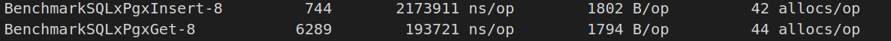

### golang: comparison of libraries pgx, sqlx, gorm
  
   libraries:

``` 
   "github.com/jackc/pgx" 
```


```
   "github.com/jmoiron/sqlx" with "github.com/jackc/pgx"
```


```
	"github.com/jmoiron/sqlx" with "github.com/lib/pq"
```


```
   "github.com/jinzhu/gorm"
```
